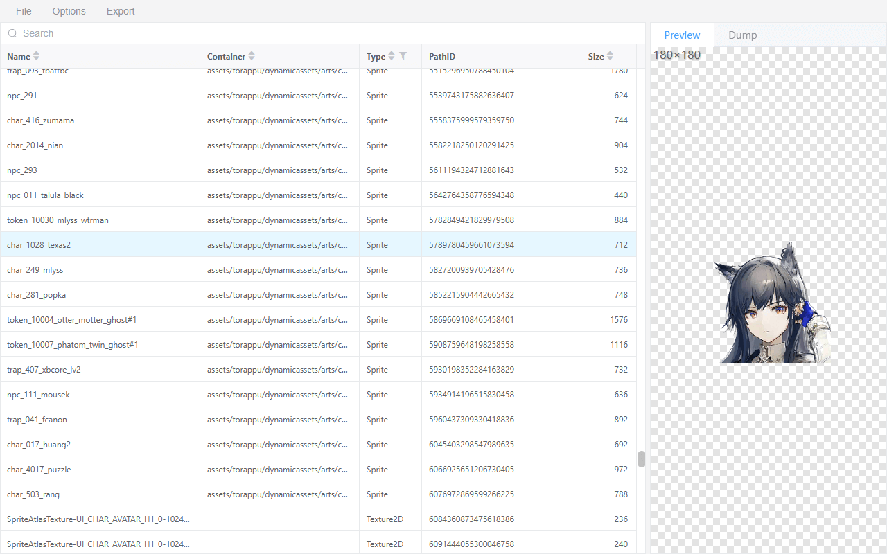

# as-web

This is a web application similar to [AssetStudio](https://github.com/Perfare/AssetStudio), all operations are completed locally.

Currently supported (but not fully):

- TextAsset
- Texture2d
- Sprite



## Development

To install dependencies:

```bash
bun install
```

To run:

```bash
bun dev
```

This project was created using `bun init` in bun v1.1.12. [Bun](https://bun.sh) is a fast all-in-one JavaScript runtime.

## Special thanks

This project mainly refers to or uses the following projects:

- [Perfare/AssetStudio](https://github.com/Perfare/AssetStudio)
- [RazTools/Studio](https://github.com/RazTools/Studio)
- [K0lb3/UnityPy](https://github.com/K0lb3/UnityPy)
- [yuanyan3060/unity-rs](https://github.com/yuanyan3060/unity-rs)
- [UniversalGameExtraction/texture2ddecoder](https://github.com/UniversalGameExtraction/texture2ddecoder)
