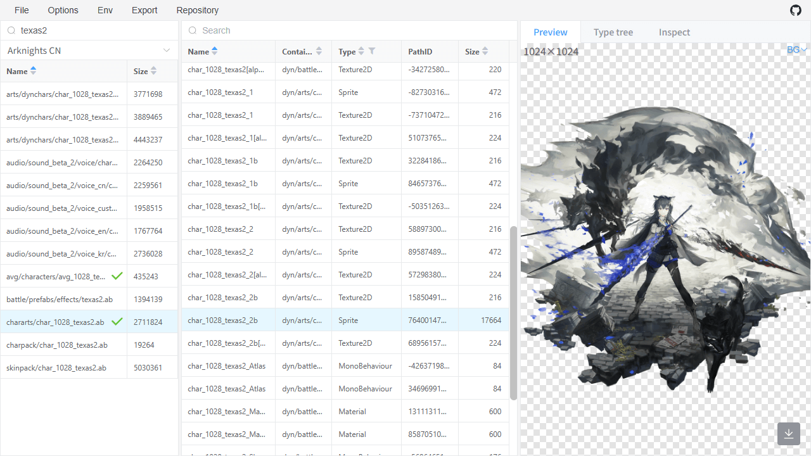
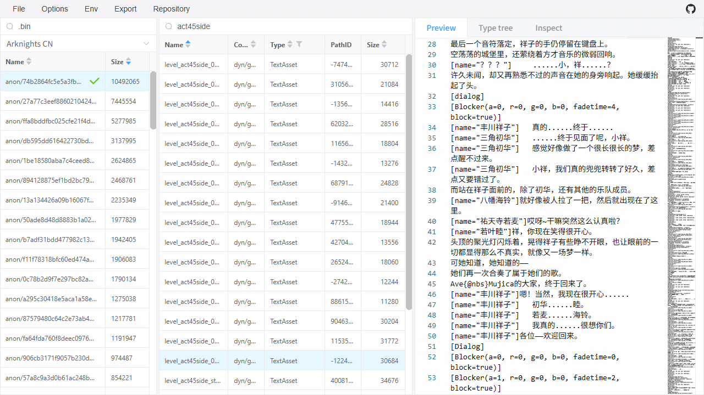
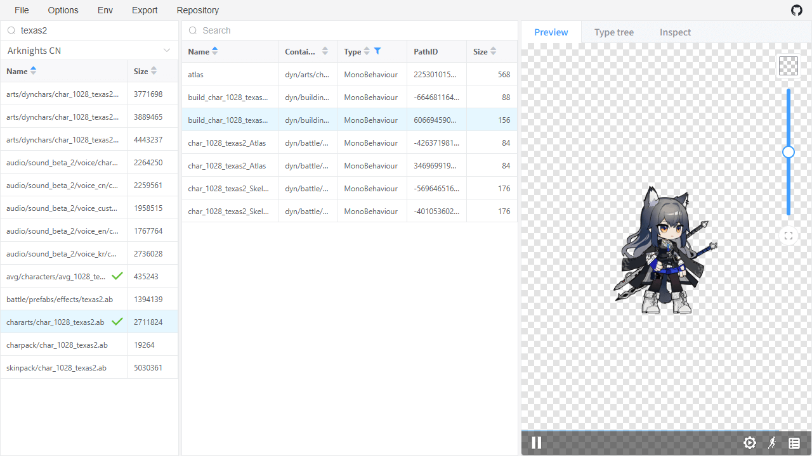
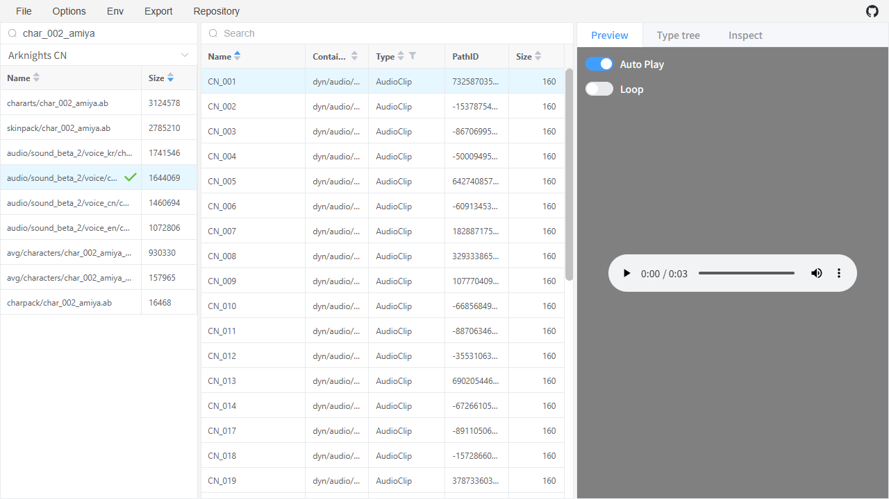

# as-web

This is a web application similar to [AssetStudio](https://github.com/Perfare/AssetStudio), all operations are completed locally.

The parsing of AssetBundle is implemented by [arkntools/unity-js](https://github.com/arkntools/unity-js). For details, please refer to that project.

For the repository feature, please check the [wiki](https://github.com/arkntools/as-web/wiki/Repository).

|                     **Image**                      |                      **Text**                      |
| :------------------------------------------------: | :------------------------------------------------: |
| [](./docs/image.png?raw=true) |  [](./docs/text.png?raw=true)  |
|                     **Spine**                      |                     **Voice**                      |
| [](./docs/spine.png?raw=true) | [](./docs/voice.png?raw=true) |

## Development

To install dependencies:

```bash
bun install
```

To run:

```bash
bun dev
```

[Bun](https://bun.sh) is a fast all-in-one JavaScript runtime.
